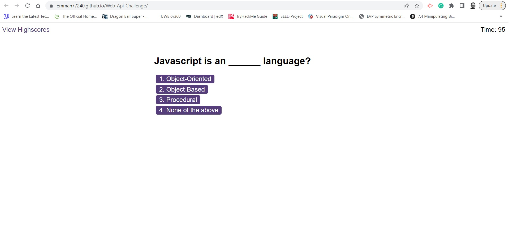

# Web-Api-Challenge

#
The code in this repository collates the responses from a quiz. At the end of each quiz session, the user gets the opportunity to add a name which is saved against his quiz score. These are collated as highscores. A live demo can be found [here](https://emman77240.github.io/Web-Api-Challenge/).

## Description
In this repository, quiz questions are dynamically added to a HTML page. After a user completes the quiz, his scores are recorded against his name which he is given the opportunity to add. The quiz is timed and when the user fails a question, 10 seconds are removed from the remaining time as penalty. The quiz can be started by clicking the "Start Quiz" button.

This website is hosted on GitHub Pages, enabling it to be seen world wide when the website address is visited.

|Header1 |Header2  | Header3|
|--- | --- | ---|
|**bold style**| `code block`|data3|
|\|escape pipe|\`backtick|data13|

## Installation
N/A

## Usage
Click the "Start Quiz" button which is visible on the page. Select your desired answers from the questions provided and add your initials at the end of the quiz.

## License
MIT License
